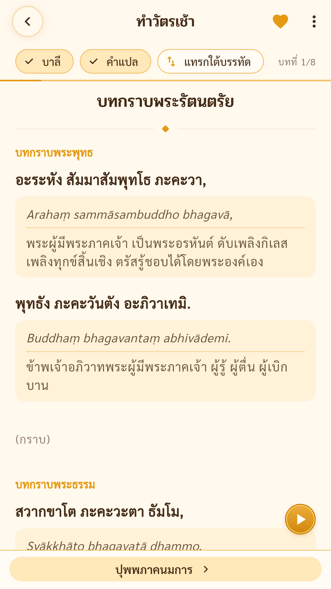

# Chanting

[](https://github.com/saddhammadana/chanting/actions/workflows/ci.yml)
[](LICENSE)

Chanting is an offline Buddhist prayer-book app built with Flutter. Prayers are in
Pali, with Thai and English editions. It has no backend and no network dependency
for normal use. Prayer content, fonts, and the optional meditation bell are
bundled with the app. It supports Android, iOS, Web, macOS, and Windows.

**Web build:** https://saddhammadana.github.io/chanting/

<p>
  
  
  
  
</p>

## Features

- A configurable home grid with shortcuts to pinned categories, prayer sets,
  saved prayers, and meditation.
- Search with highlighting and romanized Pali folding, so typing `araham` finds
  `Arahaṃ`.
- A reader with Pali and translation toggles, swipe-per-prayer and continuous
  reading modes, auto-scroll, fullscreen mode, resume position, error reports,
  and wakelock while reading.
- Personal prayer sets with ordering, continuous reading, and offline sharing by
  QR/code.
- A home card that offers the morning or evening service by the time of day,
  with a daily goal ring counting minutes chanted and meditated.
- Practice tools: meditation timer with optional looping nature sounds, and a
  floating mala counter.
- Optional singing-bowl completion sound for the meditation timer and mala
  counter. The default remains vibration only.
- A recommended prayer that changes every day.
- A first-launch tour of the home screen.
- Daily chanting reminders on mobile, for up to four times of day.
- Thai and English UI, with Thai as the default locale.
- Reader settings for font size, text color, line spacing, alignment, and theme.
- Bundled Sarabun/Pridi fonts and bundled prayer content for fully offline use.

## Development

Install [Flutter SDK](https://docs.flutter.dev/get-started/install). This project
currently uses Flutter 3.44.6 (CI runs the 3.44.0 image, the newest one
published for that line).

```sh
flutter pub get
flutter run -d chrome
sh tool/check.sh
```

`tool/check.sh` is docs links, formatting, analyzer and tests in one command —
the same script GitHub Actions runs on pull requests and the default branch.
GitHub Pages deployment stays manual; an APK is built on a version tag or on
demand.

[Contributing](CONTRIBUTING.md) has the rules a change is held to. The longer
developer documentation (architecture, content workflow, store release) is not
published in this repository yet, so a `docs/...` path or `CLAUDE.md` named in a
source comment may not resolve here.

## Project Structure

The Flutter app uses a feature-first layout:

- `lib/features/`: screens, controllers, and widgets grouped by feature.
- `lib/data/`: models, repositories, persistence, and content loading.
- `assets/data/`: bundled prayer and section data.

Prayer content lives in full locale editions such as
`assets/data/prayers-th.json` and `assets/data/prayers-en.json`, with matching
`sections-<code>.json` files.
These files are exported whole from the maintainer's content database, so an
edit made here would be undone by the next export; see
[Contributing](CONTRIBUTING.md).

## Content Note

The bundled prayers are based on commonly used Thai/Pali prayer-book sources. Any
redistribution should be checked against the source edition the maintainer chooses
as authoritative.

Each prayer record names the sources it was transcribed from in its
`meta.sources`.

## License and Reuse

Chanting source code and project documentation are open-source under the
[MIT License](LICENSE). Bundled fonts, sound, app icons, screenshots, and store
graphics are not automatically MIT-licensed:

- **Fonts** keep their upstream SIL Open Font License; the licence texts are in
  `assets/google_fonts/`.
- **Sound**: provenance and licence are in
  [assets/sound/README.md](assets/sound/README.md).
- **Illustrations** under `assets/images/` were generated with AI image tools
  for this app. The project claims no rights in them and grants no licence to
  reuse them; forks should replace the artwork.
- **App icons** are not covered by the MIT licence.

## Contributing

Please read [Contributing](CONTRIBUTING.md) and the
[Code of Conduct](CODE_OF_CONDUCT.md) before opening a pull request.
`assets/data/*.json` is an export and is not edited through this repository.

## Android Store Build

1. Create a keystore and `android/key.properties` from
   `android/key.properties.example`; both are ignored by Git and must not be
   committed.
2. Run `flutter build appbundle --release`.

Privacy policy:
https://saddhammadana.github.io/chanting/privacy.html
